## PASOS PREVIOS

### ACTUALIZAR LOS REPOSITORIOS

sudo su
apt update && apt upgrade -y

apt install -y wget curl git sudo

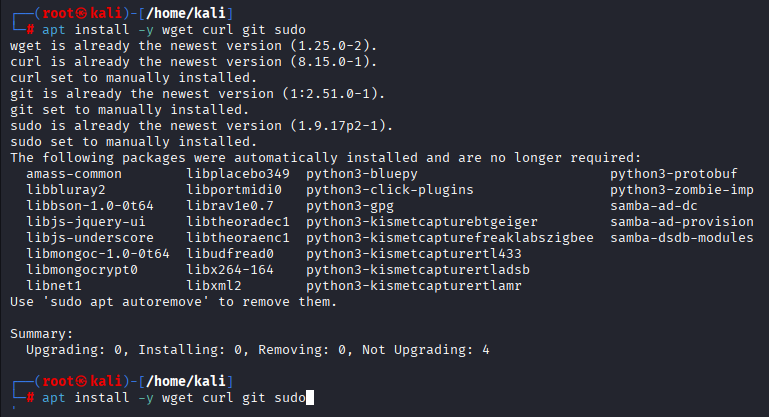

### INSTALACION DE GOPHISH

sudo apt install -y gophish

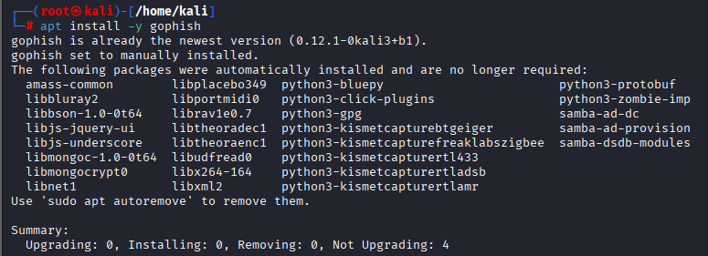

Para iniciar gophish

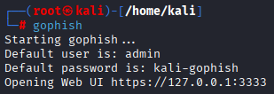

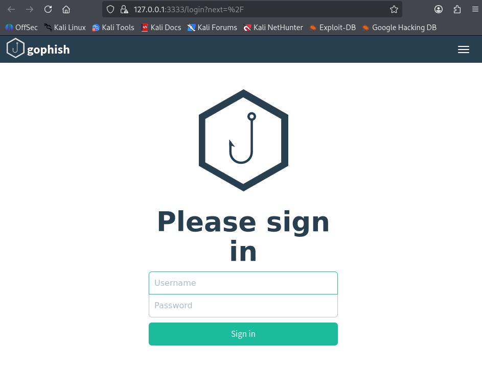

### INSTALACIÓN DE MAILHOG

Utilizamos Go para instalarlo

sudo apt-get -y install golang-go

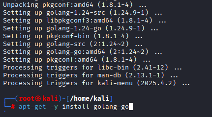

go install github.com/mailhog/MailHog@latest

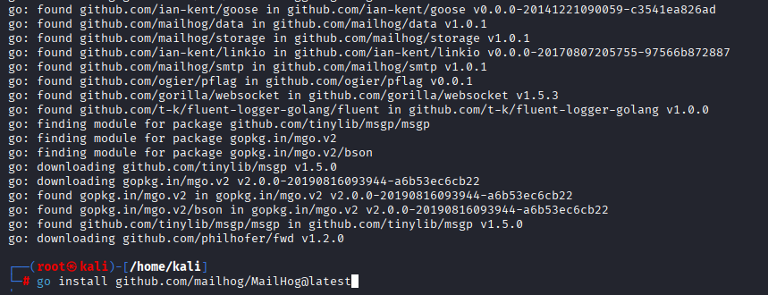

Para iniciar MailHog

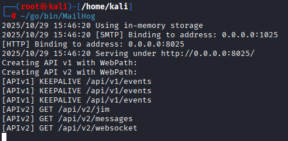

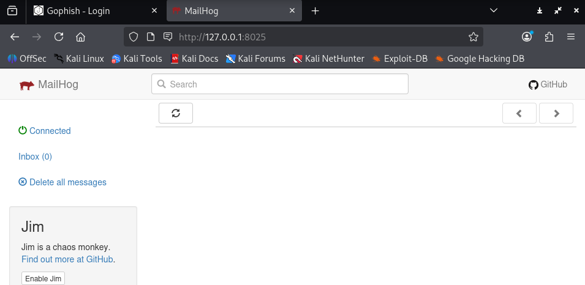

CONFIGURACIÓN DE GOPHISH
 1. SENDING PROFILES
		En este apartado configuramos la dirección del servidor SMTP, el correo desde el que se manada el phising y el usuario y contraseña (al hacerlo en local no aplica).
		
		

		Si lo hiciéramos fuera del entorno local habría que poner un usuario y contraseña, además de incluir las cabeceras de correo correspondientes (Google) para que el correo no sea desviado a la carpeta de spam.

		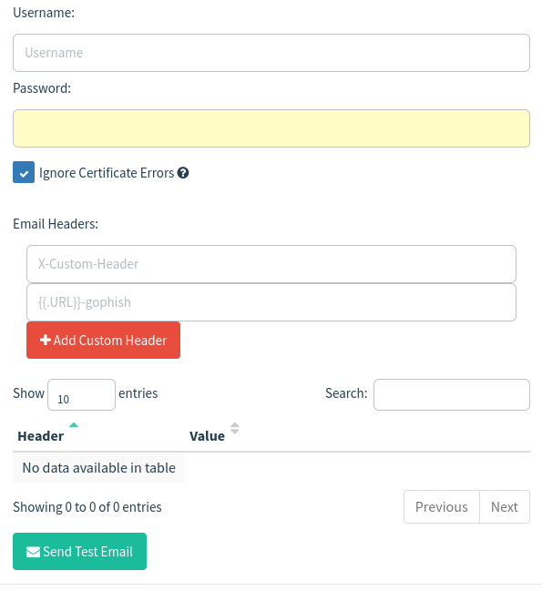
		
 3. USERS & GROUPS
		En este apartado irían las direcciones de correo a las que queremos enviar nuestro phishing, pero al estar usando mailHog, cada vez que se envíe un correo será interceptado por este (En la captura se ve la dirección a la que se debería enviar el correo).
		
		
4. EMAIL TEMPLATES
		En este apartado configuramos la plantilla del correo que vamos a mandar:
		El Envelope Sender es el correo desde el que se envía el correo, siendo la parte visible que va a ver el usuario destinatario (Para pruebas reales se recomienda que coincida con el SMTP From de la sección Sending Profile)
		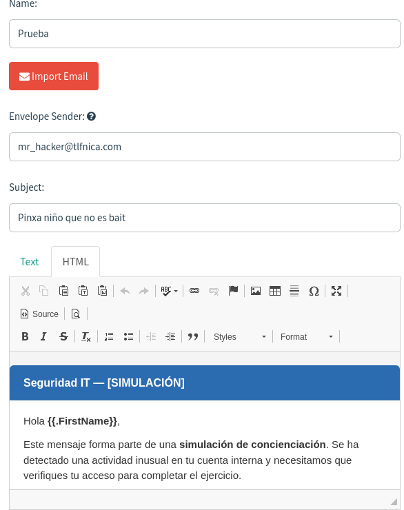
5. LANDING PAGES
		En este apartado tenemos que indicar a que página va a redirigir el correo que enviamos.
		Una vez el usuario haga click en el correo, será redigido a nuestro login, y cuando introduzca los datos, será redirigido nuevamente a otro sitio (opcional)
		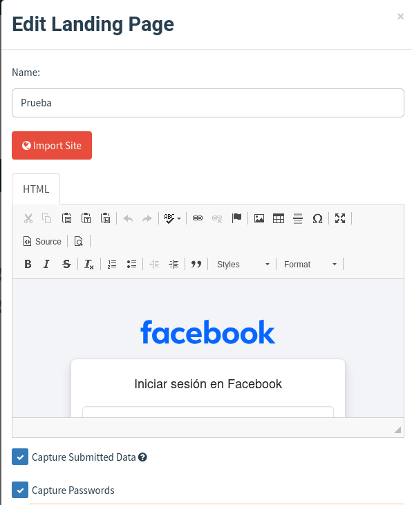
		
6. CAMPAINGS
	1. Una vez tenemos el entorno configurado, procedemos a lanzar la camapaña:
		Rellenamos los campos según las plantillas que hemos creado previamente y lanzamos la campaña (Al ser local la URL puede ser localhost)
		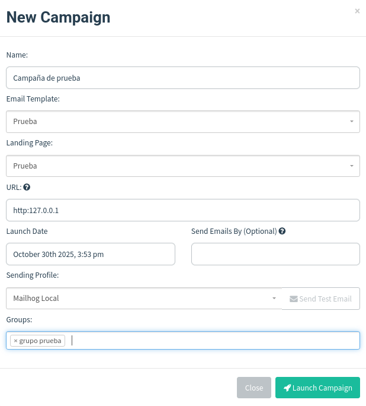
	2. Lanzamos la campaña y observamos que se ha recibido en mailHog
		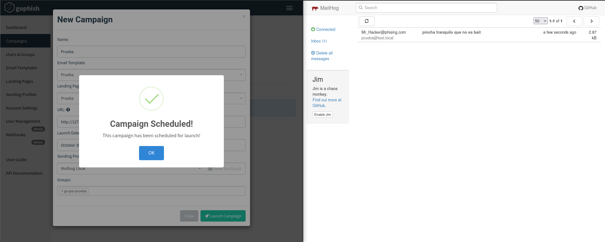
	3. Revisamos el correo recibido
		
	4. Nos redirige a nuestra landing page
		
	5. Al enviar los datos se redirige a otra web que hemos indicado
		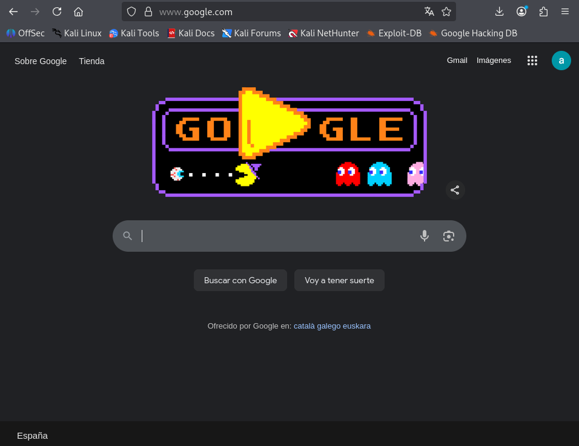
	6. Si revisamos las estadísticas de la campaña podemos observar los datos recabados
		
		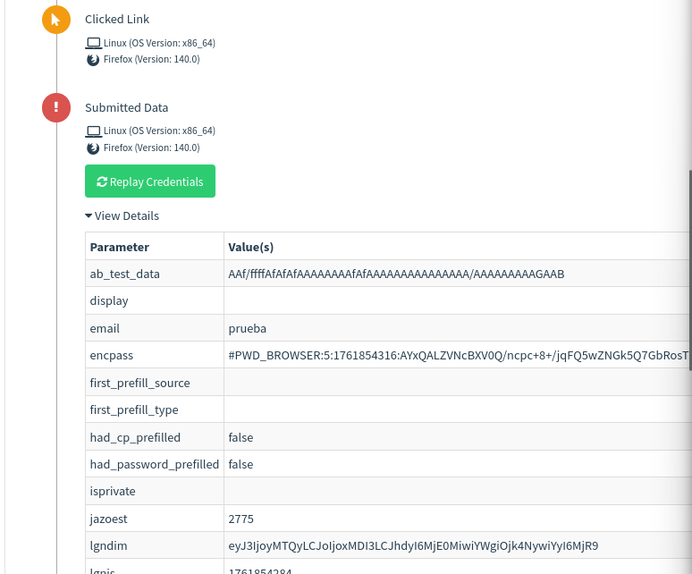

